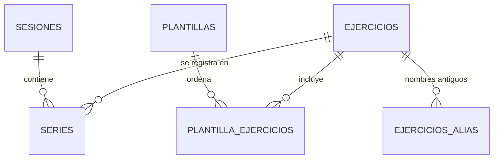

# 🏋️ Gym Tracker V2

App personal para **registrar entrenamientos desde el celular en pleno gimnasio** y **analizar el progreso desde la computadora**.
Pensada para uso real (incluso para transmitirla en vivo): rápida, con guardado ejercicio por ejercicio y acceso de solo lectura para quien la vea.

**Stack:** Python · Streamlit · PostgreSQL (Supabase) · SQLAlchemy · pandas · Altair

<!-- Agrega aquí capturas: docs/registro.png (celular), docs/progreso.png (PC) -->

## ✨ Funcionalidades

| Registro (celular) | Análisis (computadora) |
|---|---|
| Sesiones desde **plantillas** ordenables | **Resumen** semanal: sesiones, series y volumen vs. la semana anterior |
| Series prellenadas con **la última vez** + sugerencia de progresión | **Progreso** por ejercicio: peso máx., 1RM estimado, volumen, reps |
| Guardado **ejercicio por ejercicio**: si se cierra el navegador, la sesión se retoma | **Récords personales** y su historial |
| Series de calentamiento, RPE y notas opcionales (`NULL` si van vacías) | **Calendario** interactivo: toca un día y ve su sesión |
| Temporizador de descanso con sonido y vibración | **Historial** editable + respaldo en CSV |
| Catálogo de 1 300+ ejercicios en español con instrucciones | Peso corporal y calculadora de calorías/macros |

**Acceso:** cualquiera puede *ver*; **registrar y editar exige contraseña** (modo lectura / modo edición).

## 🧱 Arquitectura

```
Streamlit (views/)  →  modules/repo.py (todo el SQL)  →  modules/db.py (cachés)  →  PostgreSQL
```



Vistas SQL (`v_series_detalle`, `v_prs`, `v_pr_historial`, `v_sesiones_resumen`) concentran la lógica de análisis (1RM por fórmula de Epley, récords, volumen).

### Decisiones de diseño
- **Menos viajes a la base = app más rápida.** Cada consulta es un viaje de red. Se midió el flujo de registrar un ejercicio: de ~50 viajes a **10**
  con cinco cachés independientes (invalidadas selectivamente por cada escritura) y una función SQL (`guardar_ejercicio_sesion`) que guarda en un solo viaje.
- **Identidad por `id`, no por nombre:** renombrar un ejercicio no rompe su historial.
- **Fechas en hora local** (columna `DATE`), no en UTC: un entrenamiento a las 8 pm no cae en el día siguiente.
- **Integridad en la base:** `CHECK` (peso ≥ 0, RPE 1–10), una sola sesión abierta a la vez (índice único parcial), claves foráneas.
- **Seguridad:** Row Level Security activado, permisos revocados a los roles públicos de Supabase, secretos fuera del repositorio y bloqueo tras intentos fallidos de contraseña.
- **Errores visibles:** si la base falla, la app lo dice; nunca muestra datos vacíos como si fueran reales.

## 🚀 Puesta en marcha

```bash
git clone <este-repo> && cd Gym_TrackerV2
pip install -r requirements.txt
cp .streamlit/secrets.toml.example .streamlit/secrets.toml   # edita URL de la base y contraseña
python scripts/instalar_bd.py                                # crea tablas, vistas, funciones, catálogo y plantillas
streamlit run app.py
```

- `instalar_bd.py` es **idempotente** (se puede repetir para actualizar). Alternativa sin Python: pega los archivos de `sql/` en el SQL Editor de Supabase, en orden.
- **Streamlit Cloud:** apunta a `app.py` y pega el contenido de `secrets.toml` en *Settings → Secrets*.
- Usa la cadena del *pooler* de Supabase (IPv4). Con `?debug=1` en la URL aparece un panel con la latencia de cada llamada a la base.

## 🧪 Pruebas

Pruebas de integración de punta a punta: arrancan un PostgreSQL temporal, instalan el esquema real y ejercitan la app (login, sesión completa, plantillas, calendario, todas las pantallas).

```bash
pip install -r requirements-dev.txt
python tests/test_app.py
```

## 📁 Estructura

```
app.py               navegación y modo edición
views/               una pantalla por archivo
modules/             config · db (cachés) · auth · repo (todo el SQL) · temas · ui
sql/                 00 esquema · 01-03 catálogo/plantillas · 04 migración (opcional) · mantenimiento/
scripts/             instalar_bd.py · construir_catalogo.py (traductor de nombres EN→ES)
tests/               pruebas de integración
```

## 🗺️ Ideas pendientes
Sugerencia automática de descargas (deload) · gráficas de volumen por músculo con objetivos · exportar/importar sesiones · instalación como PWA.

## 📄 Datos y créditos
El catálogo de ejercicios proviene de un conjunto de datos de terceros (© [Gym visual](https://gymvisual.com/)). Los nombres se tradujeron
y normalizaron al español con `scripts/traductor.py`. Este repositorio **no incluye** el archivo original ni las instrucciones; revisa la licencia de la fuente antes de redistribuirlos.
